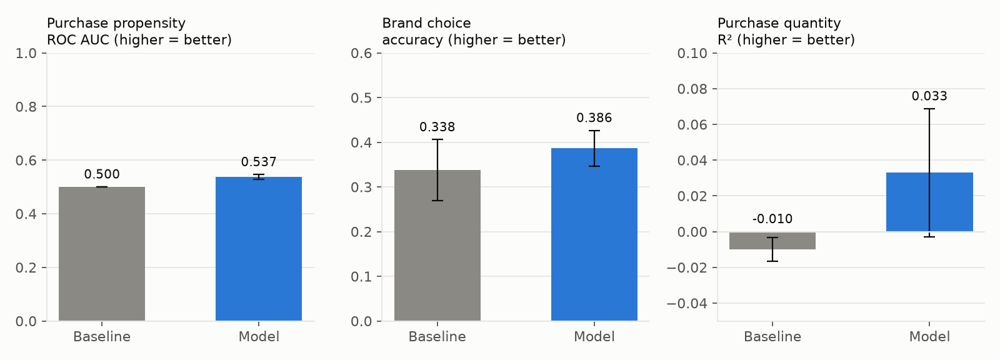
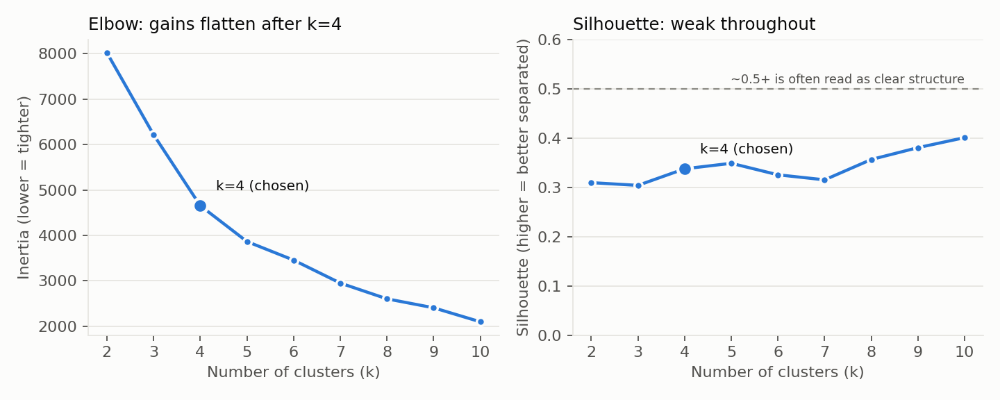
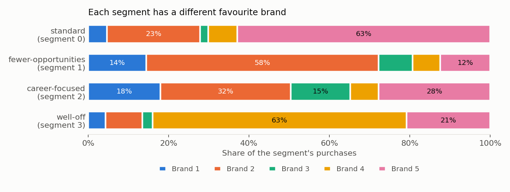
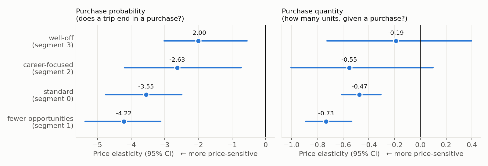
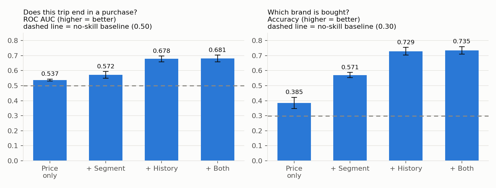

# Customer Segmentation and Purchase Behavior

**By Senay Berhe** · [tsionberhe@gmail.com](mailto:tsionberhe@gmail.com)

> Who are my customers, and how do they shop? Unsupervised segmentation (PCA + KMeans) joined to supervised purchase-behavior models, evaluated on held-out customers — with the weak spots reported, not hidden. A tested Python package, not just notebooks.

---

## Key Findings

1. **Habit beats price.** Adding a shopper's purchase history (recency and last brand) lifts brand-choice accuracy from 38.5% to 72.9% and purchase ROC AUC from 0.54 to 0.68 on customers the model never saw.
2. **Segments predict brand choice.** Each of the four segments has its own favourite brand (63%, 58%, 63% of purchases for three of them); adding the segment alone lifts brand accuracy from 38.5% to 57.1%, and it still helps new shoppers with no history (45% → 54%).
3. **Price is a real but weak predictor.** Alone it barely beats chance for whether a trip ends in a purchase (ROC AUC 0.537) and explains ~4% of purchase quantity. The price curves also extrapolate: observed average prices only span $1.87–$2.10.
4. **Price sensitivity differs by segment, with wide error bars.** Well-off shoppers are the least price-sensitive and fewer-opportunities shoppers the most; only that gap is clear-cut once uncertainty (a customer-level bootstrap) is counted.
5. **k=4 is a practical choice, not one the data forces.** Silhouette scores are ~0.34 for every k and segment stability is moderate (adjusted Rand index 0.64), so segment membership is best treated as a soft label.

Details, charts and caveats for each are below. Everything reproduces with `uv sync && uv run python main.py`.

---

## Overview

The project combines two pipelines built from raw retail data:

1. **Segmentation** — PCA + KMeans on demographics, discovering four customer segments.
2. **Purchase behavior** — models for whether a shopper buys, which of five brands they choose, and how many units, each with a price-elasticity method.

`segment_behavior.py` joins them (per-segment price response) and `history.py` adds leak-free purchase-history features. It is structured as an installable package with a consistent sklearn-style API (`fit`, `predict`, `save`/`load`), CI on Python 3.10 and 3.13, and 138 tests.

**Skills shown:** unsupervised learning and cluster validation · held-out evaluation with customer-grouped cross-validation · leak-free feature engineering · uncertainty quantification (cluster bootstrap) · careful reporting of negative and ambiguous results · package design, testing and reproducibility.

---

## Data

The datasets in `data/` (customer demographics and purchase transactions for five anonymised brands) and `audiobooks/data/` come from [365 Data Science](https://365datascience.com/) course material. The data is the starting point; the package, held-out evaluation, cluster validation, segment analysis, purchase-history features, tests and CI are built on top of it.

---

## Results

| Metric | Value |
|---|---|
| Customers segmented | 2,000 |
| Purchase transactions analysed | 58,693 |
| PCA components retained | 3 |
| Cumulative variance explained | **80.8%** |
| Customer segments discovered | **4** |

**Segment sizes**

| Segment | Customers | Share |
|---|---|---|
| 0 | 602 | 30.1% |
| 1 | 610 | 30.5% |
| 2 | 526 | 26.3% |
| 3 | 262 | 13.1% |

**Purchase behavior**

| Model | What it predicts | Example finding |
|---|---|---|
| `PurchasePropensityModel` | P(purchase) from average price | Steep curve, but **extrapolated**: observed average prices only span $1.87–$2.10 (see caveat below) |
| `BrandChoiceModel` | Which of 5 brands is chosen | Beats the brand-share baseline on held-out customers (38.5% vs 29.8% accuracy) |
| `PurchaseQuantityModel` | Units purchased | Small but real price effect; explains ~4% of quantity variance on held-out customers |

---

## Visualizations

**Customer segments in PCA space** — the 4 clusters KMeans discovers, projected onto the top 2 principal components:


**Why 3 PCA components** — cumulative explained variance flattens out after the 3rd component (80.8%), which is why the pipeline retains 3:


**How customers react to price** — purchase probability and predicted quantity both fall as price rises, the direction economic theory predicts (but read the caveat below the chart):


> **Caveat: this chart extrapolates.** The x-axis runs $1.00–$2.50, but the average price across the five brands only ever ranged from **$1.87 to $2.10** in the data (99% of trips fall inside $1.88–$2.09). The fitted curve is a logistic function pushed far beyond what was observed, so the headline numbers at the ends (78% purchase probability at $1.00, 9% at $2.50) describe the model's shape, not evidence that real shoppers would behave that way. Inside the observed range the effect is small — see the evaluation below.

**Brand choice under price competition** — each brand's probability of being chosen as its own price rises, holding competitors' prices at their historical average. Brand 3 is dashed because its price effect isn't statistically distinguishable from noise (see below):


> **On Brand 3's flat/rising curve — quantified, not just eyeballed.** The raw fitted coefficient for Brand 3 is `+0.52`, the only positive one among the five brands. Rather than trust or dismiss a single point estimate, `BrandChoiceModel.bootstrap_own_price_significance()` refits the model on 300 bootstrap resamples of the data (seeded, so the numbers reproduce) and reports a confidence interval: Brand 3's is **[-0.52, +1.26]** — it crosses zero, so the sign can't be trusted. Every other brand's interval is comfortably negative and significant (e.g. Brand 1: [-4.31, -3.37]). The likely cause: Brand 3 has the smallest market share (5.7% of purchases) and the least own-price variation of any brand (std $0.046, a $1.87–$2.14 range), so there's little signal to separate its price effect from its correlation with Brand 4's and Brand 5's prices (r = 0.42 and 0.20). The chart reflects this honestly instead of hiding it or forcing the number to look "correct."

---

## Model Evaluation

Fitting a model and plotting its curve doesn't show it predicts anything. Every model here is scored on customers it never saw: purchase data has ~117 rows per shopper, so a random row split would leak each person's habits into the test set. Folds are grouped by customer ID instead, and each model is compared with a naive baseline that ignores price (the training purchase rate, brand shares, or mean quantity). Folds are shuffled with a fixed seed and the solvers are deterministic, so every number here reproduces exactly.

### Do the supervised models predict?



*5-fold customer-grouped cross-validation; bars are means, whiskers are ±1 std across folds.*

| Model | Metric | Model | Baseline | Verdict |
|---|---|---|---|---|
| Propensity | ROC AUC | 0.537 | 0.500 | Barely better than chance; log loss (0.561 vs 0.562) and Brier score are indistinguishable from baseline |
| Brand choice | Accuracy | 0.385 | 0.298 | Real but modest lift; log loss 1.410 vs 1.446 |
| Quantity | R² | 0.042 | −0.004 | Tiny; the gain is about one fold-to-fold standard deviation (±0.036) |

**What this means.** Price is a genuine driver of *which brand* a shopper picks, but average price alone says almost nothing about *whether a given trip ends in a purchase* or *how many units*. The elasticity estimates are useful for describing direction and relative sensitivity between brands; they are not good enough to forecast individual purchases. Price alone is a weak predictor, but *who the shopper is* and *what they did last time* are not — the next two sections show the customer segment lifting brand-choice accuracy from 38.5% to 57.1%, and purchase history lifting it to 72.9%.

### Is k=4 the right number of segments?



| k | Inertia | Silhouette | Davies-Bouldin |
|---|---|---|---|
| 3 | 6,218 | 0.304 | 1.237 |
| **4** | **4,655** | **0.337** | **1.028** |
| 5 | 3,865 | 0.349 | 0.981 |
| 8 | 2,602 | 0.356 | 0.981 |
| 10 | 2,096 | 0.401 | 0.886 |

Being upfront about this: **the data doesn't single out k=4.** The elbow bends around 4 to 5, and silhouette scores (~0.30–0.40 everywhere, none near 0.5+) say the clusters overlap — demographic attributes like age, income and education form a continuum, not tight islands. Silhouette even keeps creeping up at k=9–10, but those extra groups would be too small to act on. I chose k=4 as the smallest count past the elbow that still gives segments a marketer can name and target.

Segment stability backs that up only partly: refitting on 30 bootstrap resamples and comparing with the full-data segments gives an adjusted Rand index of **0.64 on average (worst case 0.50)**. The segments are recognisably the same groups most of the time, but individual customers near a boundary do move between them, so treat segment membership as a soft label.

Reproduce everything above with `python main.py` (prints the tables) and `python -m scripts.make_evaluation_figures` (regenerates the charts).

---

## Connecting the Two Pipelines: Segments and Price Response

The segmentation and purchase-behavior pipelines are joined by `segment_behavior.py`: the fitted `SegmentationPipeline` assigns each of the 500 shoppers in the purchase data to a segment from their demographics (these are different people from the 2,000 the segments were learned on, so this also checks that the segments carry over to new customers), and then price response is estimated per segment.

### Each segment has its own favourite brand



Standard shoppers buy Brand 5 63% of the time, fewer-opportunities shoppers buy Brand 2 58%, and well-off shoppers buy Brand 4 63%. This is where segmentation earns its keep. On held-out customers (5-fold CV grouped by customer), adding the segment to the models:

| Model | Metric | Price only | + Segment |
|---|---|---|---|
| Brand choice | Accuracy | 0.385 | **0.571** |
| Brand choice | Log loss | 1.410 | **1.160** |
| Propensity | ROC AUC | 0.537 | 0.572 |
| Propensity | Log loss | 0.561 | 0.557 |

Brand choice improves a lot; whether a trip ends in a purchase improves only a little. (The next section adds purchase history, which overtakes the segment.)

### Price sensitivity differs by segment



*Elasticity at the average observed price ($2.00). Intervals come from a **customer-level** bootstrap (200 resamples of whole shoppers, not trips — one person's ~117 trips are strongly correlated, so resampling trips would understate the uncertainty).*

| Segment | Customers | Purchase-probability elasticity | Quantity elasticity |
|---|---|---|---|
| Fewer-opportunities | 181 | −4.22 [−5.37, −3.12] | −0.73 [−0.89, −0.53] |
| Standard | 145 | −3.55 [−4.76, −2.50] | −0.47 [−0.61, −0.31] |
| Career-focused | 76 | −2.63 [−4.20, −0.73] | −0.55 [−1.00, +0.10] |
| Well-off | 98 | −2.00 [−3.02, −0.56] | −0.19 [−0.73, +0.40] |

What the intervals do and don't support:
- **Well-off shoppers are less price-sensitive than fewer-opportunities shoppers** when deciding whether to buy (difference +2.2, 95% CI [+0.8, +4.0]). Versus standard shoppers the gap is borderline (+1.6, CI [+0.0, +3.0]).
- **Fewer-opportunities shoppers also cut quantity more than standard shoppers** when price rises, but only just (difference −0.26, CI [−0.45, −0.02]).
- **Career-focused and well-off quantity elasticities aren't distinguishable from zero**, and neither can be told apart from the other segments'. With only 76 and 98 shoppers, the data can't say more.
- **Don't over-read the pairs.** Across all 12 pairwise comparisons (6 segment pairs × 2 metrics) only three intervals exclude zero, and two of those barely do. With that many comparisons, one or two would look significant by chance alone; the well-off vs fewer-opportunities purchase-probability gap is the one that stands out.

**Caveats.** These are observational estimates: every shopper faces the same shelf prices on a given day, so price effects are entangled with anything else that varies by day (seasonality, store events). Segments contain 76–181 shoppers each, hence the wide intervals. And since price explains little of individual purchase decisions overall (see above), read these as a comparison of *relative* sensitivity between segments, not as forecasts.

---

## Purchase History: Habits Beat Price

`history.py` adds three features per trip, each computed **only from that shopper's earlier trips** (a trip never sees itself or the future — unit tests flip a trip's own outcome and later trips to prove nothing leaks): days since the previous purchase, whether there was any earlier purchase, and the brand bought last.



*Customer-grouped 5-fold CV; bars are means, whiskers ±1 std across folds.*

| Model | Metric | Price only | + Segment | + History | + Both |
|---|---|---|---|---|---|
| Propensity | ROC AUC | 0.537 | 0.572 | 0.678 | **0.681** |
| Propensity | Log loss | 0.561 | 0.557 | 0.526 | **0.524** |
| Brand choice | Accuracy | 0.385 | 0.571 | 0.729 | **0.735** |
| Brand choice | Log loss | 1.410 | 1.160 | 0.864 | **0.807** |

**Shoppers are creatures of habit.**
- **Brand:** 74% of purchases repeat the brand bought last time, so knowing it takes brand accuracy from 38.5% to 73%.
- **Purchase timing:** it is a *recency* effect, and the direction is not the one you might guess. A trip is most likely to end in a purchase right after a purchase, and steadily less likely the longer the gap:

| Days since last purchase | 1 | 2–3 | 5–7 | 10–14 | 20–30 | 60+ |
|---|---|---|---|---|---|---|
| Trips ending in a purchase | 54% | 42–43% | 39% | 32% | 22% | 11% |

  This most likely reflects shopper *engagement* (frequent buyers keep buying) rather than a restocking cycle. It is a predictive pattern, not a causal one.

**Segment matters less once history is known** — the last brand already reveals a shopper's preferred brand (accuracy 0.729 → 0.735). It still earns its place for new shoppers: for the 3.4% of purchases with no earlier purchase, adding the segment lifts brand accuracy from 45% to 54%. So segments answer the cold-start question that history can't.

**Price effects hold up.** Controlling for history barely moves the price coefficients (purchase-probability price coefficient −2.35 → −2.44; brand own-price coefficients essentially unchanged, and Brand 3 is still indistinguishable from zero). Price is a real but small driver next to habit.

---

## ML Pipeline

```
Raw demographic + purchase data
            │
            ▼
    StandardScaler          eliminates scale bias (age vs income)
            │
            ▼
    PCA (3 components)      reduces 7 features → 3, retains 80.8% variance
            │
            ▼
    KMeans (k=4)            discovers 4 distinct customer segments
            │
            ▼
  Segment labels + business-ready summary report
```

```
Purchase-occasion data (price, promotion, brand, quantity)
            │
            ├──▶ PurchasePropensityModel   (logistic regression)   → P(purchase | price)
            │
            ├──▶ BrandChoiceModel          (multinomial logistic)  → P(brand | 5 prices)
            │
            └──▶ PurchaseQuantityModel     (linear regression)     → predicted units
                        │
                        ▼
        Price elasticities: how demand reacts to a price change
```

---

## Project Structure

```
customer_segmentation/
│
├── docs/images/                    # Charts embedded in this README
│
├── data/                          # Raw input datasets
│   ├── segmentation+data.csv      # 2,000 customers × 8 demographic features
│   ├── purchase_data.csv          # 58,693 purchase transactions
│   └── brand_choice.csv           # Brand preference records
│
├── models/                        # Serialised, reusable model artefacts
│   ├── scaler_model.pkl
│   ├── pca_model.pkl
│   ├── kmeans_pca_model.pkl
│   ├── purchase_propensity_model.pkl
│   ├── brand_choice_model.pkl
│   └── purchase_quantity_model.pkl
│
├── notebooks/                     # Step-by-step analytical notebooks
│   ├── customer_analytics.ipynb
│   ├── customer_analytics_predictive_analysis.ipynb
│   └── purchase_analysis_descrip.ipynb
│
├── src/customer_segmentation/     # Reusable Python package
│   ├── data_loader.py             # Clean data ingestion with defaults
│   ├── segmentation.py            # SegmentationPipeline class
│   ├── purchase_behavior.py       # Purchase propensity, brand choice, quantity models
│   ├── evaluation.py              # Customer-grouped splits and cross-validation
│   ├── history.py                 # Leak-free purchase-history features
│   └── segment_behavior.py        # Per-segment price response (joins the two pipelines)
│
├── tests/
│   ├── conftest.py                # Shared synthetic purchase-data fixtures
│   ├── test_segmentation.py       # 30 tests
│   ├── test_purchase_behavior.py  # 27 tests
│   ├── test_evaluation.py         # 30 tests
│   ├── test_segment_behavior.py   # 27 tests
│   └── test_history.py            # 24 tests — 138 total, 100% passing
│
├── scripts/
│   └── make_evaluation_figures.py # Regenerates the evaluation charts
│
├── main.py                        # Runnable pipeline entry point
├── audiobooks/                    # Separate Keras side project (optional `audiobooks` dependency group)
└── pyproject.toml                 # Dependency management (uv)
```

---

## How to Run

```bash
# 1. Install (requires uv: pip install uv). This installs the package and its
#    dependencies into .venv, and lets you `import customer_segmentation`.
uv sync

# 2. Run both pipelines (segmentation, purchase behavior, segment analysis)
uv run python main.py

# 3. Run the test suite
uv run pytest

# 4. Regenerate the charts in docs/images/
uv run python -m scripts.make_evaluation_figures
```

Optional dependency groups keep the default install light:

```bash
uv sync --group notebooks    # JupyterLab + seaborn for the analysis notebooks
uv sync --group audiobooks   # adds TensorFlow for the audiobooks/ side project
```

`audiobooks/` is a separate deep-learning experiment (a small Keras neural network
predicting whether an audiobook customer converts). It is unrelated to the pipelines above and isn't
needed to run or test them.

---

## Code Highlights

**Clean pipeline API — sklearn-style interface**
```python
from customer_segmentation import SegmentationPipeline, load_segmentation_data
from customer_segmentation.data_loader import SEGMENTATION_FEATURES

df = load_segmentation_data()
X = df[SEGMENTATION_FEATURES]

pipeline = SegmentationPipeline(n_components=3, n_clusters=4)
labels = pipeline.fit_predict(X)

print(pipeline.segment_summary(X).xs("mean", axis=1, level=1))   # per-segment feature means
print(pipeline.explained_variance())          # [0.357, 0.263, 0.188]
```

**Model persistence — deploy without retraining**
```python
pipeline.save()                          # serialises to models/

pipeline = SegmentationPipeline.load()   # reload anywhere
labels = pipeline.predict(new_customers)
```

**Predicting how customers react to price**
```python
from customer_segmentation import PurchasePropensityModel, load_purchase_data

df = load_purchase_data()
model = PurchasePropensityModel().fit(df)

model.predict_proba([1.0, 2.5])     # [0.776, 0.092]  — P(purchase) at each price
model.price_elasticity([1.0, 2.5])  # [-0.53, -5.34]  — demand grows more elastic as price rises
```

**Not trusting a coefficient just because it fit — quantifying uncertainty**
```python
from customer_segmentation import BrandChoiceModel, load_purchase_data

df = load_purchase_data()
occasions = df[df["Incidence"] == 1]
brand_model = BrandChoiceModel().fit(occasions)

est = brand_model.bootstrap_own_price_significance(brand=3, purchase_occasions=occasions, random_state=0)
est.mean, est.ci_low, est.ci_high, est.is_significant
# (0.40, -0.52, 1.26, False)  — the CI crosses zero, so this brand's
# apparent positive price coefficient can't actually be trusted
```

---

## Testing Philosophy

I treat tests as a first-class concern, not an afterthought. The test suite validates:

- **Data contracts** — schema, missing values, column presence
- **Guard rails** — clear errors if any model is used before fitting
- **Correctness** — label counts, array shapes, explained variance bounds, probabilities summing to 1
- **Economic sanity** — purchase probability and quantity both fall as price rises (the direction a real elasticity should have)
- **Statistical honesty** — a bootstrapped confidence interval, not just a point estimate, is available before trusting a coefficient's sign
- **No feature leakage** — history features never use the trip itself or later trips, and are independent across shoppers
- **Segment analysis** — assignment is constant within a shopper, designed segment differences are recovered, and a synthetic check confirms the segment feature lifts held-out brand accuracy
- **Evaluation integrity** — train and test folds never share a customer; models are compared against a baseline; a model fit on shuffled targets can't beat the mean
- **Reproducibility** — `fit_predict` and `fit` → `predict` give identical results
- **Persistence** — saved and loaded models produce identical predictions

```bash
pytest tests/ -v
# 138 passed
```

---

## Technologies

`Python 3.10+` · `scikit-learn` · `pandas` · `numpy` · `matplotlib` · `seaborn` · `JupyterLab` · `pytest` · `uv` · `GitHub Actions` (tests on Python 3.10 and 3.13)

---

*Thanks for taking the time to look at my work. I'd love to discuss the decisions I made and how I'd extend this further.*
