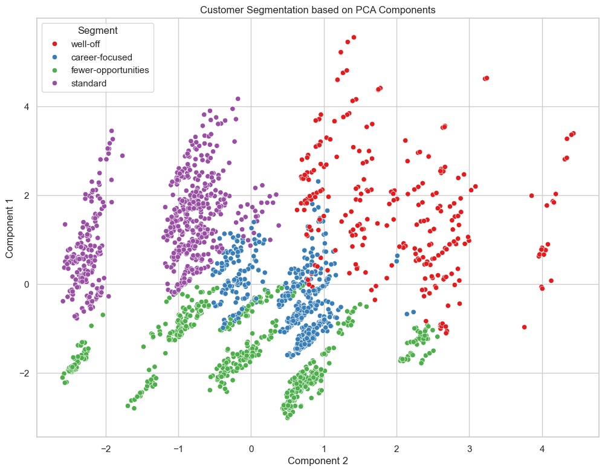
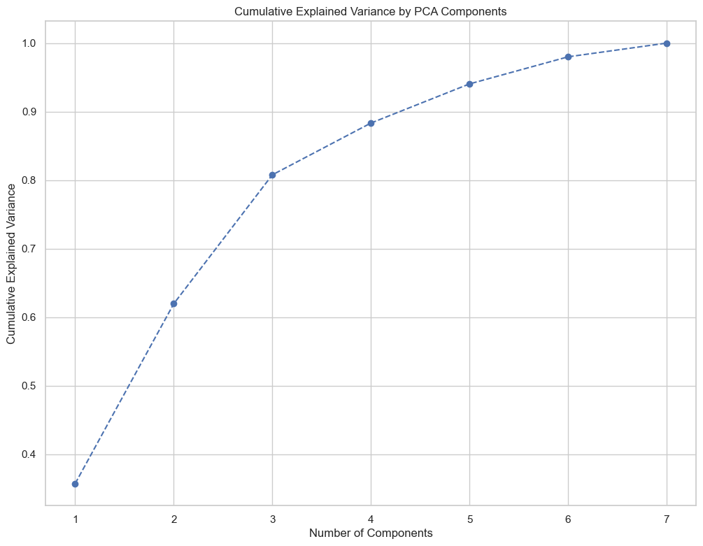
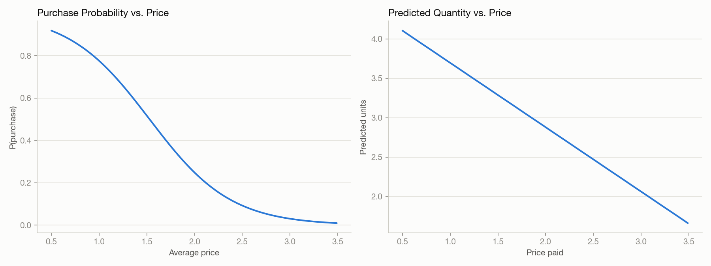
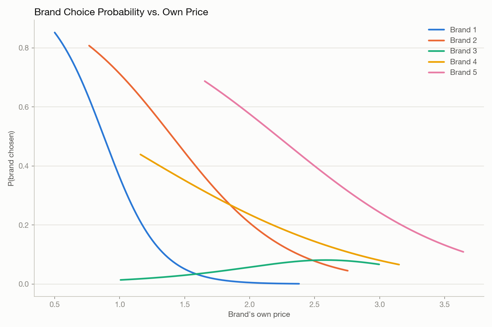

# Customer Segmentation — Data Science Portfolio Project

**By Senay Berhe** · [tsionberhe@gmail.com](mailto:tsionberhe@gmail.com)

> An end-to-end machine learning project demonstrating skills in exploratory data analysis, unsupervised clustering, supervised predictive modeling, dimensionality reduction, software engineering best practices, and production-ready code design.

---

## Project Overview

This project builds a complete customer analytics system from raw retail data, combining two complementary ML pipelines:

1. **Segmentation** — unsupervised PCA + KMeans on demographic data, discovering four distinct customer segments.
2. **Purchase behavior prediction** — supervised models that predict *how customers react* to price and promotions: the probability they purchase at all, which of five brands they choose, and how many units they buy.

Together these answer both "who are my customers?" and "how will they respond if I change price?" — insight a business could directly use to personalise marketing, run promotions, and set prices.

The project goes beyond a notebook prototype: it is structured as a proper Python package with a clean API, model persistence, and a full test suite.

---

## Skills Demonstrated

| Area | What I did |
|---|---|
| **Unsupervised ML** | Applied PCA for dimensionality reduction and KMeans clustering to discover meaningful customer groups |
| **Supervised predictive modeling** | Logistic regression for purchase propensity and multinomial brand choice; linear regression for purchase quantity — each with a price-elasticity method |
| **Feature engineering** | Selected and scaled 7 demographic features; reasoned about ordinal vs continuous encoding; engineered price/promotion incidence features for the purchase models |
| **Statistical thinking** | Used explained variance analysis to justify retaining 3 PCA components (80.8% variance captured); derived price elasticities from fitted regression coefficients and flagged a counter-intuitive coefficient sign for further investigation rather than accepting it uncritically |
| **Software engineering** | Structured code as a reusable Python package (`src/` layout) with clear separation of concerns across two pipelines |
| **API design** | Designed `SegmentationPipeline`, `PurchasePropensityModel`, `BrandChoiceModel`, and `PurchaseQuantityModel` classes with a consistent sklearn-style interface (`fit`, `predict`/`predict_proba`) |
| **Model persistence** | Implemented `save()` / `load()` on every model with proper serialisation so models can be deployed without retraining |
| **Testing** | Wrote 52 pytest tests covering correctness, edge cases, guard rails, economic sanity checks (higher price ⇒ lower demand), and round-trip persistence |
| **Exploratory analysis** | Three Jupyter notebooks documenting EDA, predictive analysis, and purchase behaviour deep-dives |

---

## Results

| Metric | Value |
|---|---|
| Customers segmented | 2,000 |
| Purchase transactions analysed | 58,693 |
| PCA components retained | 3 |
| Cumulative variance explained | **80.8%** |
| Customer segments discovered | **4** |

**Segment sizes**

| Segment | Customers | Share |
|---|---|---|
| 0 | 602 | 30.1% |
| 1 | 610 | 30.5% |
| 2 | 526 | 26.3% |
| 3 | 262 | 13.1% |

**Purchase behavior**

| Model | What it predicts | Example finding |
|---|---|---|
| `PurchasePropensityModel` | P(purchase) from average price | Drops from 78% at $1.00 to 9% at $2.50 |
| `BrandChoiceModel` | Which of 5 brands is chosen | Own-price elasticity ranges from -0.05 (inelastic, low price) to -2.47 (elastic, high price) for the top-share brand |
| `PurchaseQuantityModel` | Units purchased | Falls from 3.7 to 2.5 units as price rises from $1.00 to $2.50 |

---

## Visualizations

**Customer segments in PCA space** — the 4 clusters KMeans discovers, projected onto the top 2 principal components:



**Why 3 PCA components** — cumulative explained variance flattens out after the 3rd component (80.8%), which is why the pipeline retains 3:



**How customers react to price** — purchase probability and predicted quantity both fall as price rises, exactly as economic theory predicts:



**Brand choice under price competition** — each brand's probability of being chosen as its own price rises, holding competitors' prices at their historical average:



> **Note on Brand 3:** every brand's choice probability falls with its own price *except* Brand 3, whose fitted coefficient is slightly positive. I checked this wasn't a bug in the elasticity code (it isn't — the raw sklearn coefficient itself is `+0.50`) before shipping the chart. Brand 3 has the smallest market share in the data (5.7% of purchases), which likely limits how well the model can identify a clean price effect for it. Flagging this rather than smoothing it over is deliberate — a good next step would be a regularised or hierarchical model that pools information across brands.

---

## ML Pipeline

```
Raw demographic + purchase data
            │
            ▼
    StandardScaler          eliminates scale bias (age vs income)
            │
            ▼
    PCA (3 components)      reduces 7 features → 3, retains 80.8% variance
            │
            ▼
    KMeans (k=4)            discovers 4 distinct customer segments
            │
            ▼
  Segment labels + business-ready summary report
```

```
Purchase-occasion data (price, promotion, brand, quantity)
            │
            ├──▶ PurchasePropensityModel   (logistic regression)   → P(purchase | price)
            │
            ├──▶ BrandChoiceModel          (multinomial logistic)  → P(brand | 5 prices)
            │
            └──▶ PurchaseQuantityModel     (linear regression)     → predicted units
                        │
                        ▼
        Price elasticities: how demand reacts to a price change
```

---

## Project Structure

```
customer_segmentation/
│
├── docs/images/                    # Charts embedded in this README
│
├── data/                          # Raw input datasets
│   ├── segmentation+data.csv      # 2,000 customers × 8 demographic features
│   ├── purchase_data.csv          # 58,693 purchase transactions
│   └── brand_choice.csv           # Brand preference records
│
├── models/                        # Serialised, reusable model artefacts
│   ├── scaler_model.pkl
│   ├── pca_model.pkl
│   ├── kmeans_pca_model.pkl
│   ├── purchase_propensity_model.pkl
│   ├── brand_choice_model.pkl
│   └── purchase_quantity_model.pkl
│
├── notebooks/                     # Step-by-step analytical notebooks
│   ├── customer_analytics.ipynb
│   ├── customer_analytics_predictive_analysis.ipynb
│   └── purchase_analysis_descrip.ipynb
│
├── src/customer_segmentation/     # Reusable Python package
│   ├── data_loader.py             # Clean data ingestion with defaults
│   ├── segmentation.py            # SegmentationPipeline class
│   └── purchase_behavior.py       # Purchase propensity, brand choice, quantity models
│
├── tests/
│   ├── test_segmentation.py       # 30 tests
│   └── test_purchase_behavior.py  # 22 tests — 52 total, 100% passing
│
├── main.py                        # Runnable pipeline entry point
└── pyproject.toml                 # Dependency management (uv)
```

---

## How to Run

```bash
# 1. Install dependencies (requires Python ≥ 3.10)
pip install uv && uv sync

# 2. Run both pipelines (segmentation + purchase-behavior prediction)
python main.py

# 3. Run the test suite
pytest tests/ -v
```

---

## Code Highlights

**Clean pipeline API — sklearn-style interface**
```python
from src.customer_segmentation import SegmentationPipeline, load_segmentation_data
from src.customer_segmentation.data_loader import SEGMENTATION_FEATURES

df = load_segmentation_data()
X = df[SEGMENTATION_FEATURES]

pipeline = SegmentationPipeline(n_components=3, n_clusters=4)
labels = pipeline.fit_predict(X)

print(pipeline.segment_summary(X).xs("mean", axis=1, level=1))   # per-segment feature means
print(pipeline.explained_variance())          # [0.357, 0.263, 0.188]
```

**Model persistence — deploy without retraining**
```python
pipeline.save()                          # serialises to models/

pipeline = SegmentationPipeline.load()   # reload anywhere
labels = pipeline.predict(new_customers)
```

**Predicting how customers react to price**
```python
from src.customer_segmentation import PurchasePropensityModel, load_purchase_data

df = load_purchase_data()
model = PurchasePropensityModel().fit(df)

model.predict_proba([1.0, 2.5])     # [0.776, 0.093]  — P(purchase) at each price
model.price_elasticity([1.0, 2.5])  # [-0.53, -5.33]  — demand grows more elastic as price rises
```

---

## Testing Philosophy

I treat tests as a first-class concern, not an afterthought. The test suite validates:

- **Data contracts** — schema, missing values, column presence
- **Guard rails** — clear errors if any model is used before fitting
- **Correctness** — label counts, array shapes, explained variance bounds, probabilities summing to 1
- **Economic sanity** — purchase probability and quantity both fall as price rises (the direction a real elasticity should have)
- **Reproducibility** — `fit_predict` and `fit` → `predict` give identical results
- **Persistence** — saved and loaded models produce identical predictions

```bash
pytest tests/ -v
# 52 passed in 0.87s
```

---

## Technologies

`Python 3.10+` · `scikit-learn` · `pandas` · `numpy` · `matplotlib` · `seaborn` · `JupyterLab` · `pytest` · `uv`

---

*Thanks for taking the time to look at my work. I'd love to discuss the decisions I made and how I'd extend this further.*
